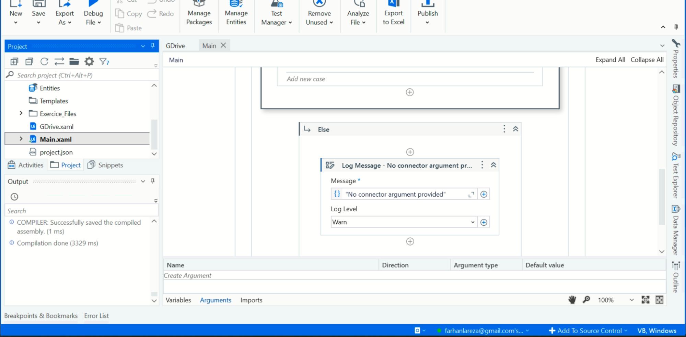

# UiPath Academy Automation Developer Associate Training

This repository contains my solutions for various exercises from the UiPath Academy’s Automation Developer Associate Training course. Each folder represents a chapter, with subfolders corresponding to individual exercises. Screenshots of the solutions are also included for reference. 

## Table of Contents

### [1. Data Manipulation with Strings in Studio](#1-data-manipulation-with-strings-in-studio)
    
[1.1. Extract Email Address Using String Methods](#11-extract-email-address-using-string-methods)

[1.2. Extract Email Address Using Regex](#12-extract-email-address-using-regex)

[1.3. String Manipulation Using String Activities](#13-string-manipulation-using-string-activities)
   
### [2. Data Manipulation with Lists and Dictionaries in Studio](#2-data-manipulation-with-lists-and-dictionaries-in-studio)

[2.1. Using Lists](#21-using-lists)

[2.2. Using Dictionaries and Integers](#22-using-dictionaries-and-integers)
   
### [3. UI Automation Synchronization with Studio](#3-ui-automation-synchronization-with-studio)

[3.1. Check App State and Verify Execution](#31-check-app-state-and-verify-execution)
   
### [4. UI Automation Descriptors in Studio](#4-ui-automation-descriptors-in-studio)

[4.1. Fix My Workflow](#41-fix-my-workflow)

[4.2. Fine-tuning the Descriptor](#42-fine-tuning-the-descriptor)
   
### [5. Selectors in Studio Deep Dive](#5-selectors-in-studio-deep-dive)

[5.1. Highlight WFT Type Items on ACME](#51-highlight-wft-type-items-on-acme)
   
### [6. Debugging in Studio](#6-debugging-in-studio)

[6.1. Fix My Workflow](#61-fix-my-workflow)
   
### [7. Error and Exception Handling in Studio](#7-error-and-exception-handling-in-studio)

[7.1. Try Catch](#71-try-catch)

[7.2. Retry Scope](#72-retry-scope)
   
### [8. Working with Local Files and Folders in Studio](#8-working-with-local-files-and-folders-in-studio)

[8.1. File and Folder Automation](#81-file-and-folder-automation)
   
### [9. Email Automation with Studio](#9-email-automation-with-studio)

[9.1. Email Filtering and Sending](#91-email-filtering-and-sending)
   
### [10. PDF Automation with Studio](#10-pdf-automation-with-studio)

[10.1. Extract Data from PDFs](#101-extract-data-from-pdfs)

[10.2. Extract Data from Multiple PDFs](#102-extract-data-from-multiple-pdfs)
    
### [11. Data Manipulation with Data Tables in Studio](#11-data-manipulation-with-data-tables-in-studio)

[11.1. Calculating Sums](#111-calculating-sums)

[11.2. Calculating Expense Percentages](#112-calculating-expense-percentages)
    
### [12. Working with Orchestrator Resources](#12-working-with-orchestrator-resources)

[12.1. Using Orchestrator Resources](#121-using-orchestrator-resources)

[12.2. Using Queues](#122-using-queues)
    
### [13. UiPath Integration Service Overview](#13-uipath-integration-service-overview)

[13.1. Integration with Google Drive and Gmail](#131-integration-with-google-drive-and-gmail)
    
### [14. Workflow Analyzer in Studio](#14-workflow-analyzer-in-studio)

[14.1. Project Analysis](#141-project-analysis)
    
### [15. RPA Testing with Studio](#15-rpa-testing-with-studio)

[15.1. Automating and Testing Hashing](#151-automating-and-testing-hashing)

## 1. Data Manipulation with Strings in Studio

### 1.1. **Extract Email Address Using String Methods**  

A workflow that extracts and displays the email address from a string using string methods.

### 1.2. **Extract Email Address Using Regex**  

A workflow that extracts all email addresses from a provided template file using regular expressions.

### 1.3. **String Manipulation Using String Activities**  

A workflow that extracts an employee's first and last name from a text file, and uses this information to complete a message:
_"Hello Mr/Ms/Mrs `<first_name> <last_name>`, we would like to invite you to our product launch event next week. Please confirm by the end of the week."_

## 2. Data Manipulation with Lists and Dictionaries in Studio

### 2.1. **Using Lists**  

Given a list of countries, this workflow sorts them alphabetically and prints the first three countries in descending order.  
_Input_: `{"Germany", "Spain", "Japan", "Brazil", "India", "China"}`  
_Output_: `Spain, Japan, India`

### 2.2. **Using Dictionaries and Integers**  

This exercise calculates the number of Tour de France victories for each winner using a dictionary.  
_Input_: A dictionary of winners from 2006–2018.  
_Output_: Displays each winner and their number of victories.

## 3. UI Automation Synchronization with Studio

### 3.1. **Check App State and Verify Execution**  

A workflow that checks if a user is logged into the ACME page, and if so, navigates to the "Add New Vendor" section. If not, it logs an error message.  
_Vendor details_:  
- Vendor ID: 10001  
- Vendor Name: Ironman Inc  
- Address: 1 MG Road, Bengaluru, India

## 4. UI Automation Descriptors in Studio

### 4.1. **Fix My Workflow**  

A troubleshooting task where the workflow is corrected to search for the movie "Ice Age" on IMDb, retrieve the rating, and display it.

### 4.2. **Fine-tuning the Descriptor**  
   
Enhances the previous workflow by allowing user input for the movie title, searches IMDb, retrieves the rating, and displays it.

## 5. Selectors in Studio Deep Dive

### 5.1. **Highlight WFT Type Items on ACME**  
   
This exercise highlights specific workflow types (WI1–WI5) on the ACME Work Items page, based on user input.

## 6. Debugging in Studio

### 6.1. **Fix My Workflow**  
   
Debug a workflow that inputs data into the RPA Challenge website after reading it from an Excel file, correcting execution errors.

## 7. Error and Exception Handling in Studio

### 7.1. **Try Catch**  
   
A workflow that calculates the difference between "Cash In" and "Cash Out" values from an Excel file, using Try-Catch blocks to handle conversion errors.

### 7.2. **Retry Scope**  
   
Automates a process where the workflow retries opening a Notepad application based on a random variable, handling failure scenarios effectively.

## 8. Working with Local Files and Folders in Studio

### 8.1. **File and Folder Automation**  

A workflow that extracts, renames, and sorts contract and invoice files into corresponding folders based on company names.

## 9. Email Automation with Studio

### 9.1. **Email Filtering and Sending**  

Automates retrieving unread emails from the last 30 days with "Invoice" in the subject, and generates a report with email details, sending it as an attachment.

## 10. PDF Automation with Studio

### 10.1. **Extract Data from PDFs**  
   
A workflow that extracts the date and total from scanned PDFs and writes the information into an Excel file.

### 10.2. **Extract Data from Multiple PDFs**  
   
A similar workflow to extract invoice details (number, date, and total) from multiple native PDF files.

## 11. Data Manipulation with Data Tables in Studio

### 11.1. **Calculating Sums**  
   
A workflow that adds the values from two columns and writes the result into a third column.

### 11.2. **Calculating Expense Percentages**  
   
A workflow that consolidates expenses from various payment methods and calculates each category's percentage of the total expenses.

## 12. Working with Orchestrator Resources

### 12.1. **Using Orchestrator Resources**  
   
Updates an automation project to retrieve the ACME URL from the Orchestrator.

### 12.2. **Using Queues**  
   
Automates the insertion of account details from an Excel file into ACME Bank, using a dispatcher-performer model with Orchestrator queues.

## 13. UiPath Integration Service Overview

### 13.1. **Integration with Google Drive and Gmail**  
   
An automation that triggers when a file is uploaded to Google Drive, sending email notifications using Gmail with data derived from an Excel file.

## 14. Workflow Analyzer in Studio

### 14.1. **Project Analysis**  

A task to identify and solve errors and warnings in a workflow using the Workflow Analyzer.

## 15. RPA Testing with Studio

### 15.1. **Automating and Testing Hashing**  

A data-driven RPA test case that verifies hash codes for the keyword "UiPath" using different hash methods like MD5, CRC32, etc.

